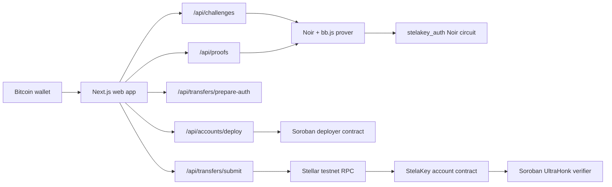

# StelaKey

Bitcoin-wallet-controlled Stellar smart accounts with zero-knowledge authorization.

StelaKey ports the SatKey idea to Stellar: a user keeps their Bitcoin wallet, signs a Stellar authorization intent, and uses a zero-knowledge proof to authorize a Stellar smart account action. The on-chain Stellar account sees proof data and public hashes, not the Bitcoin private key, raw Bitcoin signature, or raw Bitcoin public key.

## Honest Status

As of June 23, 2026, this is a real hackathon MVP foundation, not a fully finished payment product.

Working now:

- The web app has a public landing page and protected app routes.
- Production is deployed at `https://stelakey.vercel.app` and `https://stelakey-fawuzan.vercel.app`.
- Bitcoin wallet connection and message signing are wired through `sats-connect`.
- Account setup derives the same BN254 Poseidon owner commitment used by the Noir circuit.
- The Stellar testnet account deployer and UltraHonk verifier contracts are deployed.
- The Soroban account contract implements `__check_auth`.
- The prover service verifies an ECDSA Bitcoin message signature, runs the Noir circuit, and generates UltraHonk proof artifacts through `@aztec/bb.js`.
- The deployed prover bundle no longer depends on runtime git access: Noir `poseidon` and `sha256` dependencies are vendored into the circuit package and copied into each isolated proof job.
- The transfer API prepares a real Stellar Asset Contract transfer authorization payload and can attach proof data to the Soroban authorization entry before submit.
- The transfer UI clears stale prepared authorization whenever recipient, amount, asset, or issuer changes.
- The transfer UI records payment success only when the submit response includes a real Stellar transaction hash.

Not complete yet:

- A real connected browser wallet has not completed and confirmed a Bitcoin-authorized Stellar transfer end to end.
- The production app must still be tested through an installed wallet extension for the full prepare -> sign -> prove -> submit path.
- Contract negative tests for wrong owner, wrong payload, expired proof, replay, and malformed public inputs still need to be added.

No fake state rule:

- No fake proof success.
- No fake transaction hashes.
- No fake balances.
- No fixture wallet activity.
- No explorer link unless it came from a real Stellar response.

## App Flow

```text
Landing page
  -> connect Bitcoin wallet
  -> protected StelaKey app
  -> create or load Stellar smart account
  -> prepare a Stellar action
  -> Bitcoin wallet signs the StelaKey message
  -> prover generates a ZK proof
  -> relayer submits a Soroban transaction with proof as account auth
  -> account __check_auth verifies proof before the action can execute
```

### 1. Wallet Connect

The browser connects a Bitcoin wallet through `sats-connect`. The app stores only public wallet session data needed for the user flow: provider, address, public key, and network.

Supported provider targets in the app code:

- Xverse
- Leather
- UniSat
- generic compatible provider

### 2. Account Setup

The user can create a deterministic Stellar smart account controlled by their Bitcoin public key commitment.

```text
Bitcoin secp256k1 public key
  -> uncompressed x/y coordinates
  -> 16-byte field limbs
  -> BN254 Poseidon hash_5
  -> owner_commitment
  -> Soroban deployer deploy_account(...)
  -> Stellar contract account address
```

The deployer uses the owner commitment as the account salt, so the account address is deterministic for the same Bitcoin public key and deployment config.

### 3. Transfer Authorization

For an XLM transfer, the transfer service:

1. Builds a real Stellar Asset Contract `transfer` invocation from the StelaKey account to the recipient.
2. Uses Stellar RPC preflight data to find the Soroban auth entry for the StelaKey account.
3. Builds the exact Soroban authorization preimage.
4. Hashes that preimage into `signature_payload_hash`.
5. Builds a canonical StelaKey intent hash for the action.
6. Returns the payload needed for wallet signing and proof generation.

The transfer is not submitted at this stage. If preparation fails, the API returns a rejected response and no transaction is sent.

### 4. Bitcoin Wallet Signature

The app asks the Bitcoin wallet to sign this canonical message:

```text
StelaKey v1
network=0x{network_hash}
payload=0x{signature_payload_hash}
intent=0x{stellar_intent_hash}
```

The prover uses Bitcoin signed-message hashing:

```text
bitcoin_hash = SHA256(SHA256(
  "\x18Bitcoin Signed Message:\n" ||
  varint(message_length) ||
  message
))
```

Current v1 wallet scheme:

```text
wallet_scheme = 1 = compact secp256k1 ECDSA message signature
```

BIP-322 and Schnorr are explicitly rejected until they are implemented and tested.

### 5. ZK Proof

The Noir circuit proves:

```text
I know:
  pubkey_x, pubkey_y, sig_r, sig_s

such that:
  ECDSA_secp256k1_verify(
    pubkey_x,
    pubkey_y,
    sig_r,
    sig_s,
    bitcoin_signed_message_hash(canonical_stelakey_message)
  ) == true

and:
  owner_commitment =
    Poseidon5_BN254(
      limb16(pubkey_x, 0),
      limb16(pubkey_x, 16),
      limb16(pubkey_y, 0),
      limb16(pubkey_y, 16),
      0x5354454c414b4559
    )
```

The public proof outputs bind the proof to:

- `owner_commitment`
- `stellar_intent_hash`
- `signature_payload_hash`
- `network_hash`
- `expiry_ledger`
- `replay_key`
- `wallet_scheme`

The private witness contains:

- Bitcoin public key coordinates
- Bitcoin signature `r` and `s`

The Bitcoin key material is needed to prove the statement, but the raw key and raw signature are not exposed on-chain by the proof interface.

More detail is in [docs/protocol.md](/Users/kaizen/Desktop/stela/docs/protocol.md).

### 6. Soroban Account Verification

The account contract implements `__check_auth`. Stellar calls it when the account is required to authorize an action.

The account checks:

- the proof owner commitment matches the account owner commitment
- the proof signature payload hash matches Stellar's current `__check_auth` payload
- the proof network hash matches the configured Stellar network hash
- the proof expiry ledger has not passed
- the proof wallet scheme is the supported ECDSA message scheme
- the UltraHonk verifier contract accepts `public_inputs` and `proof_bytes`

Only after those checks pass can the Stellar action execute.

## Architecture



## Tech Stack

Frontend:

- Next.js 15
- React 19
- TypeScript
- Tailwind CSS 4
- local shadcn-style primitives
- Hugeicons
- `sats-connect` for Bitcoin wallet connection and message signing

Proof stack:

- Noir circuit in `apps/web/prover-circuit`
- standalone protocol circuit in `circuits/stelakey_auth`
- `nargo` for compile and witness execution
- `@aztec/bb.js` 0.87.0 for UltraHonk proving and local verification
- BN254 Poseidon through Noir `poseidon`
- Noir SHA-256 package for Bitcoin message hashing
- Vendored Noir path dependencies under `apps/web/prover-circuit/deps` so serverless proof generation does not call `git`
- Noir secp256k1 ECDSA verification
- `poseidon-lite` and `@noble/secp256k1` for server-side matching checks

Stellar stack:

- Soroban Rust contracts
- `@stellar/stellar-sdk` 16
- Stellar testnet RPC
- Stellar Asset Contract transfers
- Contract account authorization through `__check_auth`

Infrastructure:

- pnpm workspace
- Vercel for the web app and same-origin API routes
- Stellar testnet for deployed contracts and transactions

## API Routes

| Route | Purpose | Important behavior |
| --- | --- | --- |
| `/api/challenges` | Builds the canonical StelaKey wallet message | Rejects missing hashes or invalid wallet data. |
| `/api/proofs` | Verifies wallet signature and generates proof | Rejects unsupported signature schemes; no transaction is submitted on proof failure. |
| `/api/prover/health` | Reports prover readiness | Checks circuit, `nargo`, bb.js runtime assets, and HMAC secret in production. |
| `/api/accounts/deploy` | Creates or loads a Stellar account contract | Uses real Stellar RPC and deployer config; rejects invalid wallet fields. |
| `/api/accounts/balance` | Reads account XLM balance | Must return real Stellar data only. |
| `/api/accounts/fund` | Funds an account on testnet when configured | Uses a real configured signer and real Stellar response. |
| `/api/transfers/prepare-auth` | Prepares a Stellar transfer auth payload | Does not ask for a wallet signature until Stellar returns a real auth payload. |
| `/api/transfers/submit` | Attaches proof data and submits transfer | Sends only after proof data is supplied and Stellar accepts the signed transaction. |
| `/api/transfers/health` | Reports transfer signer/readiness | Fails closed when signer or network config is missing. |

## Contracts

```text
contracts/account
  StelaKey smart account.
  Stores owner commitment, verifier address, verification key hash,
  network hash, account tag, pause flag, and version.
  Implements __check_auth.

contracts/deployer
  Deterministic account deployer.
  Uses owner_commitment as the salt.

contracts/verifier
  Stores the UltraHonk verification key.
  Verifies proof bytes and public inputs.
```

## Deployed Testnet Config

Real testnet infrastructure was deployed on June 21, 2026.

```text
Network: testnet
RPC: https://soroban-testnet.stellar.org
Verifier contract: CCFJSBSDOOT65K56MNBLZLAPZ47ZJ64F3TKP4VNOTFXSCEMQ7P3A54LS
Account deployer contract: CDG2AJMIVLEVBV2HE7KLK3LHOO6FVGHLEUW63ID2YK6O5755BHF62HZA
Current account WASM hash: a15735d74aa1c892063d75014bdc848ec9f7987813064b4b09c37cb6bc69646e
Verification key hash: 6dfbb9837b001ef99c7b32afdfb9e488f6c15c24f7eea9e76291ee1916b1966b
```

## Environment

Copy `.env.example` and fill the values needed for the environment being run.

Public web config:

```bash
NEXT_PUBLIC_STELLAR_NETWORK=testnet
NEXT_PUBLIC_STELLAR_RPC_URL=https://soroban-testnet.stellar.org
NEXT_PUBLIC_STELAKEY_VERIFIER_CONTRACT_ID=
NEXT_PUBLIC_STELAKEY_DEPLOYER_CONTRACT_ID=
NEXT_PUBLIC_STELAKEY_ACCOUNT_WASM_HASH=
```

Server config:

```bash
STELLAR_NETWORK_PASSPHRASE="Test SDF Network ; September 2015"
STELLAR_DEPLOYER_SECRET_KEY=
STELAKEY_DEPLOYER_SECRET_KEY=
RELAYER_SECRET_KEY=
STELLAR_RELAYER_SECRET_KEY=
RELAYER_AUTH_LEDGER_TTL=120
PROVER_HMAC_SECRET=
NARGO_BIN=
```

Production requires `PROVER_HMAC_SECRET`. Transfer and funding routes require a real configured Stellar signer.

## Local Development

Install:

```bash
pnpm install
```

Run the web app:

```bash
pnpm dev:web
```

Typecheck:

```bash
pnpm typecheck
```

Build:

```bash
pnpm build
```

Build the circuit:

```bash
bash scripts/build-circuit.sh
```

## Completion Requirements

StelaKey should only be called complete when all of these pass:

- a real user connects a Bitcoin wallet in the deployed app
- the user creates or loads a real StelaKey account contract
- the app prepares a real Stellar transfer authorization payload
- the wallet signs the exact canonical StelaKey message
- the prover returns real UltraHonk proof bytes and public inputs
- the transfer submit route attaches that proof to the Soroban auth entry
- Stellar confirms the transaction
- the UI shows only the real returned transaction hash and explorer link
- wrong wallet, wrong payload, expired proof, malformed proof, and replay attempts fail

Current readiness details are tracked in [docs/finish-readiness.md](/Users/kaizen/Desktop/stela/docs/finish-readiness.md).

## Known Caveats

- The Noir SHA-256 package currently emits Brillig constraint-check warnings during circuit builds. That must be resolved or explicitly accepted before production/security claims.
- The current proof path supports compact secp256k1 ECDSA Bitcoin message signatures only.
- The first transfer target is XLM on Stellar testnet.

## Hackathon Fit

StelaKey fits Stellar Hacks: Real-World ZK because the proof is load-bearing. The ZK proof is not decorative UI state; it is the account authorization mechanism. Without a valid proof for the exact Stellar authorization payload, `__check_auth` rejects and the Stellar action cannot execute.
